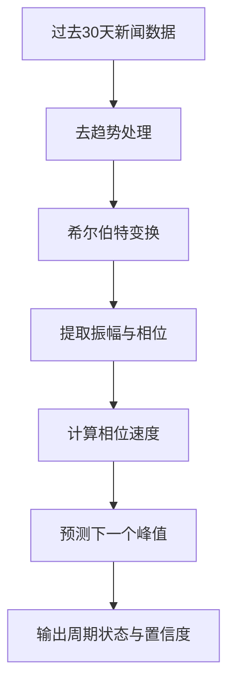
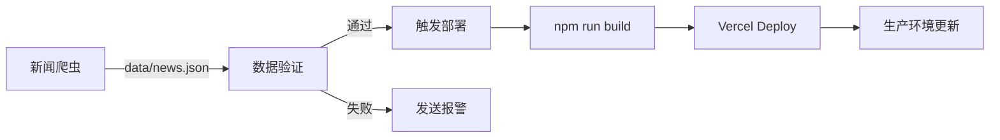

# 伊朗情报看板 - 项目深度解读

> **版本**: v1.0
> **日期**: 2026-03-04
> **在线地址**: https://iran-intelligence-dashboard.vercel.app

---

## 一、项目概述

### 1.1 项目定位

**伊朗情报看板**（Iran Intelligence Dashboard）是一个专业的地缘政治风险监测平台，专注于伊朗局势的实时监控与趋势预测。项目采用多源数据融合策略，为 OSINT 分析师、情报决策者和风险管理人员提供态势感知能力。

### 1.2 核心价值

| 维度 | 描述 |
|------|------|
| **实时性** | 多数据源小时级更新，关键指标 5 分钟刷新 |
| **预测性** | 基于希尔伯特变换的相位分析算法，预测冲突升级时间窗口 |
| **全面性** | 整合预测市场、新闻、资产价格等多维度数据 |
| **专业性** | 深色科技风 UI 设计，符合情报分析工作场景 |

### 1.3 技术栈全景

```
┌─────────────────────────────────────────────────────────────────┐
│                        前端展示层                                  │
│   Next.js 14 + React 18 + TypeScript + Tailwind CSS + Recharts   │
└─────────────────────────────────────────────────────────────────┘
                              ▲
                              │
┌─────────────────────────────────────────────────────────────────┐
│                        API 服务层                                  │
│   /api/polymarket-real  →  Polymarket GraphQL API               │
│   /api/markets-real      →  Yahoo Finance API                   │
│   /api/news-crawler      →  Web Crawler (Reuters, BBC, etc.)    │
│   /api/probability       →  Hilbert Phase Analysis              │
└─────────────────────────────────────────────────────────────────┘
                              ▲
                              │
┌─────────────────────────────────────────────────────────────────┐
│                        数据处理层                                  │
│   Python: 希尔伯特相位分析 | Playwright: 新闻爬虫                │
│   OpenClaw Cron: 定时任务编排 | JSON: 本地数据存储                │
└─────────────────────────────────────────────────────────────────┘
```

---

## 二、四大核心功能模块

### 模块一：Polymarket 预测市场面板

#### 功能描述
展示 Polymarket 平台上与伊朗相关的预测市场数据，包括军事冲突、能源、制裁、外交等类别的实时概率。

#### 数据来源
| 项目 | 详情 |
|------|------|
| **API** | `https://gamma-api.polymarket.com/query` |
| **关键词** | iran, israel, middle east, oil, gaza, hamas, hezbollah, houthis, yemen, strait, nuclear |
| **更新频率** | 5 分钟缓存 |
| **降级策略** | API 失败时使用模拟数据 |

#### 核心指标
- **市场概率**: 当前预测概率 (0-100%)
- **1 小时变化**: 短期概率波动
- **24 小时变化**: 日内趋势
- **交易量**: 市场活跃度
- **分类标签**: 冲突/制裁/能源/外交

#### 组件位置
`app/components/PolymarketPanel.tsx`

---

### 模块二：实时新闻小时报

#### 功能描述
每小时自动抓取伊朗相关新闻，进行分类、摘要和关键信息提取，生成小时情报摘要。

#### 数据来源（10 个新闻源）

| 新闻源 | 覆盖重点 | URL |
|--------|----------|-----|
| Reuters | 国际新闻、中东局势 | reuters.com/world/middle-east |
| Al Jazeera | 阿拉伯视角、巴以冲突 | aljazeera.com/middle-east |
| BBC | 英国媒体、国际视角 | bbc.com/news/world/middle_east |
| The Guardian | 深度报道 | theguardian.com/world/middleeast |
| Al Arabiya | 阿联酋媒体 | alarabiya.net/News/middle-east |
| Jerusalem Post | 以色列媒体 | jpost.com/international |
| Times of Israel | 以色列视角 | timesofisrael.com |
| Iran International | 伊朗反对派媒体 | iranintl.com |
| Middle East Eye | 中东深度分析 | middleeasteye.net |
| Haaretz | 以色列左翼媒体 | haaretz.com/middle-east-news |

#### 关键词过滤
```
地区类: iran, iranian, tehran, israel, middle east, gulf, hormuz, strait
主题类: sanction, nuclear, missile, drone, rocket, attack, strike, war
组织类: hamas, hezbollah, irgc, revolutionary guard
```

#### 重要性自动分级
| 级别 | 触发词示例 |
|------|------------|
| **Critical** | war, invasion, killed, nuclear weapon |
| **High** | sanction, missile, retaliation, escalation, conflict |
| **Medium** | 其他相关新闻 |

#### 更新机制
- **爬取频率**: 每 15 分钟（避免 IP 封禁）
- **请求间隔**: 每个源之间 1 秒延迟
- **缓存时长**: 15 分钟

#### 组件位置
`app/components/NewsPanel.tsx`

---

### 模块三：希尔伯特相位分析（冲击事件概率模型）

#### 算法原理

基于**希尔伯特变换**（Hilbert Transform）的时间序列分析方法，将新闻数量时间序列转换为复平面上的解析信号：

```
z(t) = x(t) + i·H(x(t))

其中:
- x(t): 去趋势后的新闻数量序列
- H(x(t)): 希尔伯特变换（90° 相位平移）
- 振幅 A(t) = |z(t)| = √(x² + H(x)²)
- 相位 φ(t) = arg(z(t)) = atan2(H(x), x)
```

#### 分析流程



#### 输出指标

| 指标 | 说明 |
|------|------|
| **当前相位** | 0-360°，表示在周期中的位置 |
| **振幅强度** | 信号强度，反映事件活跃度 |
| **相位速度** | 度/天，相位推进速率 |
| **周期位置** | 上升期/峰值期/下降期/谷值期 |
| **预测峰值日期** | 下一个冲突升级概率峰值时间 |
| **置信度** | 0.3-0.95，基于振幅稳定性计算 |

#### 代码位置
`hilbert_phase_analyzer.py` - Python 算法实现

#### 更新频率
每天 03:00 自动运行（通过 OpenClaw Cron）

---

### 模块四：高频敏感资产监控

#### 监控资产列表

| 资产 | 代码 | 类别 | 数据源 |
|------|------|------|--------|
| WTI 原油 | CL=F | 能源 | Yahoo Finance |
| 布伦特原油 | BZ=F | 能源 | Yahoo Finance |
| 黄金 | GC=F | 贵金属 | Yahoo Finance |
| 白银 | SI=F | 贵金属 | Yahoo Finance |
| 美元指数 | DX-Y.NYB | 外汇 | Yahoo Finance |
| 标普 500 | ^GSPC | 股指 | Yahoo Finance |

#### 核心功能
- **实时价格**: 当前最新价格
- **涨跌幅**: 24 小时价格变化
- **迷你 K 线**: 价格趋势可视化
- **多资产对比**: 并排展示便于分析

#### 更新频率
- **前端刷新**: 每 5 分钟
- **API 缓存**: 2 分钟
- **降级策略**: API 失败时使用模拟数据

#### 组件位置
`app/components/AssetsPanel.tsx`

---

## 三、数据类型定义

### TypeScript 类型体系

```typescript
// Polymarket 事件
interface PolymarketEvent {
  id: string;
  title: string;
  probability: number;        // 当前概率
  change1h: number;           // 1小时变化
  change24h: number;          // 24小时变化
  volume: number;             // 交易量
  category: 'conflict' | 'sanction' | 'energy' | 'diplomacy';
  trend: 'up' | 'down' | 'stable';
  history: { time: string; probability: number }[];
}

// 新闻条目
interface NewsItem {
  id: string;
  title: string;
  summary: string;
  source: string;
  url?: string;
  timestamp: string;
  category: 'domestic' | 'us' | 'israel' | 'energy' | 'military' | 'sanction' | 'diplomacy';
  importance: 'low' | 'medium' | 'high' | 'critical';
  tags: string[];
}

// 概率指标
interface ProbabilityMetric {
  id: string;
  name: string;
  probability: number;        // 0-100
  trend: 'up' | 'down' | 'stable';
  change24h: number;
  confidence?: number;
  factors?: string[];
  triggers?: TriggerFactor[];
}

// 资产价格
interface AssetPrice {
  symbol: string;
  name: string;
  price: number;
  change: number;
  changePercent: number;
  currency: string;
  miniChart: { time: string; value: number }[];
}
```

---

## 四、自动化任务编排

### OpenClaw Cron 定时任务

| 任务名 | Cron 表达式 | 时区 | 职责 |
|--------|-------------|------|------|
| iran-news-crawler | `0 * * * *` | Asia/Shanghai | 每小时执行新闻爬虫 |
| iran-dashboard-data-refresh | `*/15 * * * *` | Asia/Shanghai | 每 15 分钟刷新前端数据 |
| iran-dashboard-deploy | `5 * * * *` | Asia/Shanghai | 数据更新后自动部署到 Vercel |
| iran-phase-analysis-nightly | `0 3 * * *` | Asia/Shanghai | 每天凌晨 3 点执行相位分析 |

### 任务执行流程



---

## 五、项目文件结构

```
iran-intelligence-dashboard/
├── app/
│   ├── api/                          # API 路由层
│   │   ├── polymarket-real/route.ts  # Polymarket 真实数据
│   │   ├── markets-real/route.ts     # 金融市场数据
│   │   ├── news-crawler/route.ts     # 新闻爬虫
│   │   ├── probability/route.ts      # 概率模型数据
│   │   └── news-real/route.ts        # GDELT 备用 API
│   ├── components/                   # React 组件
│   │   ├── PolymarketPanel.tsx       # Polymarket 面板
│   │   ├── NewsPanel.tsx             # 新闻面板
│   │   ├── ProbabilityPanel.tsx      # 概率模型面板
│   │   ├── AssetsPanel.tsx           # 资产监控面板
│   │   └── ShippingPanel.tsx         # 航运态势面板
│   ├── lib/
│   │   └── mockData.ts               # 模拟数据（降级用）
│   ├── types/
│   │   └── index.ts                  # TypeScript 类型定义
│   ├── globals.css                   # 全局样式
│   ├── layout.tsx                    # 根布局
│   └── page.tsx                      # 主页面
├── data/                             # 数据文件（受保护）
│   ├── news.json                     # 新闻数据
│   ├── polymarket.json               # Polymarket 缓存
│   ├── assets.json                   # 资产价格缓存
│   └── phase_analysis.json           # 相位分析结果
├── scripts/                          # Python 脚本
│   ├── crawl_news.py                 # 新闻爬虫
│   ├── crawl_news_real.py            # 实时爬虫
│   ├── crawl_news_hourly.py          # 小时爬虫
│   └── protect-data.sh               # 数据保护脚本
├── public/                           # 静态资源
│   └── data/
│       └── polymarket.json           # 公共数据副本
├── hilbert_phase_analyzer.py         # 希尔伯特相位分析器
├── run_phase_analysis.py             # 相位分析运行脚本
├── package.json                      # 项目配置
├── next.config.mjs                   # Next.js 配置
├── tsconfig.json                     # TypeScript 配置
├── tailwind.config.ts                # Tailwind CSS 配置
├── deploy.sh                         # 部署脚本
├── vercel.json                       # Vercel 部署配置
├── README.md                         # 项目说明
├── REQUIREMENTS.md                   # 功能需求文档
├── DATA_SOURCES.md                   # 数据源说明
├── NEWS_SOURCES.md                   # 新闻源说明
├── CRON_CONFIG.md                    # 定时任务配置
├── DEPLOY_OSS.md                     # OSS 部署文档
└── MANAGEMENT.md                     # 管理规范
```

---

## 六、技术亮点

### 6.1 希尔伯特相位分析

**创新点**: 将信号处理技术应用于地缘政治事件预测

**优势**:
- 无需历史标签数据
- 实时适应新态势
- 可解释性强（相位、振幅等物理意义明确）

**数学基础**:
```
解析信号: z(t) = x(t) + i·H(x(t))
瞬时振幅: A(t) = |z(t)|
瞬时相位: φ(t) = arg(z(t))
相位速度: v(t) = dφ/dt
```

### 6.2 多源数据融合

| 数据源 | 类型 | 价值 |
|--------|------|------|
| Polymarket | 预测市场 | 群体智慧，事件发生概率 |
| 新闻爬虫 | 文本信息 | 实时事件，定性分析 |
| 金融市场 | 价格数据 | 经济影响，风险定价 |
| 希尔伯特分析 | 算法模型 | 周期识别，时间预测 |

### 6.3 智能降级策略

```
API 请求 → 成功 → 使用真实数据
    ↓
   失败 → 检查缓存 → 有缓存 → 使用缓存
    ↓                    ↓
   无缓存 ← ← ← ← ← 使用模拟数据
```

### 6.4 前端架构设计

- **静态导出**: 无服务器成本，部署简单
- **自动刷新**: 多级定时刷新（5 分钟/15 分钟/1 小时）
- **响应式布局**: 桌面/平板/移动端自适应
- **错误处理**: 优雅降级，用户友好提示

---

## 七、部署架构

### 7.1 生产环境

```
┌─────────────────────────────────────────────────────────────┐
│                      用户浏览器                               │
└─────────────────────────────────────────────────────────────┘
                          ▲
                          │ HTTPS
                          ▼
┌─────────────────────────────────────────────────────────────┐
│                    Vercel Edge CDN                           │
│          https://iran-intelligence-dashboard.vercel.app      │
└─────────────────────────────────────────────────────────────┘
                          ▲
                          │ Git Push
                          ▼
┌─────────────────────────────────────────────────────────────┐
│                  GitHub 代码仓库                              │
│         触发 Vercel 自动部署                                   │
└─────────────────────────────────────────────────────────────┘
                          ▲
                          │ 定时任务
                          ▼
┌─────────────────────────────────────────────────────────────┐
│                  OpenClaw Cron                                │
│    - 每小时新闻爬虫                                           │
│    - 每天相位分析                                             │
│    - 自动推送更新                                             │
└─────────────────────────────────────────────────────────────┘
```

### 7.2 部署命令

```bash
# 本地开发
npm run dev

# 构建生产版本
npm run build

# 本地预览构建结果
npm run start

# 一键部署到 Vercel
./deploy.sh
# 或
npx vercel deploy --prod
```

---

## 八、维护指南

### 8.1 日常监控

| 检查项 | 频率 | 方法 |
|--------|------|------|
| 数据更新状态 | 每日 | 检查 data/ 目录文件时间戳 |
| API 可用性 | 每日 | 查看前端是否有错误提示 |
| 爬虫运行状态 | 每日 | 检查 news.json 更新时间 |
| 相位分析结果 | 每日 | 查看 phase_analysis.json |

### 8.2 常见问题处理

| 问题 | 可能原因 | 解决方案 |
|------|----------|----------|
| 新闻不更新 | 爬虫被封 | 检查爬虫日志，调整请求频率 |
| 价格数据异常 | Yahoo API 变化 | 检查 API 路由，更新解析逻辑 |
| 相位分析无结果 | 数据不足 | 确保有至少 30 天历史数据 |
| 部署失败 | Vercel Token 过期 | 更新 vercel.json 中的 token |

### 8.3 数据保护规则

⚠️ **重要**: 禁止手动修改 `data/` 目录下的文件

- 所有数据更新必须通过定时任务或 API 完成
- 手动修改可能导致数据格式不一致
- 使用 `scripts/protect-data.sh` 设置文件保护

---

## 九、后续迭代计划

### V1.1（近期）
- [ ] 新闻数据源稳定性优化
- [ ] 相位分析算法验证与调优
- [ ] 移动端适配完善

### V1.5（中期）
- [ ] 预警系统（邮件/飞书/Telegram）
- [ ] 历史数据回溯分析
- [ ] 多维度关联分析（新闻-市场-概率联动）

### V2.0（远期）
- [ ] AI 驱动的智能研判报告
- [ ] 自定义监控面板配置
- [ ] 开放 API 接口

---

## 十、总结

### 项目优势

1. **多源数据**: 整合预测市场、新闻、金融市场、算法模型
2. **实时更新**: 多级定时刷新机制，确保数据时效性
3. **智能算法**: 希尔伯特相位分析提供独特预测视角
4. **专业设计**: 深色科技风 UI，符合情报分析场景
5. **自动运维**: OpenClaw Cron 全自动数据更新与部署

### 技术特色

| 特色 | 说明 |
|------|------|
| **希尔伯特分析** | 信号处理技术应用于地缘政治预测 |
| **10 源爬虫** | 多新闻源并行抓取与智能过滤 |
| **优雅降级** | API 失败时自动使用缓存/模拟数据 |
| **静态导出** | 无服务器成本，CDN 加速 |
| **类型安全** | 完整的 TypeScript 类型体系 |

---

*文档生成时间: 2026-03-04*
*项目版本: v1.0*
*技术栈: Next.js 14 + React 18 + TypeScript + Python*
